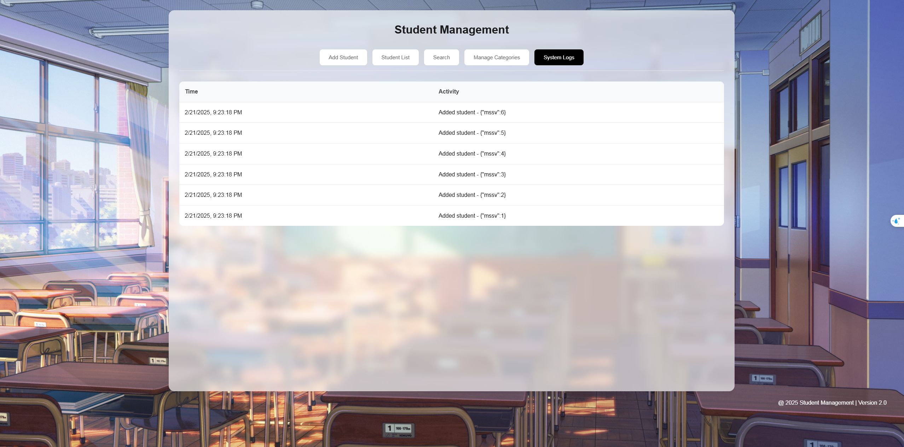
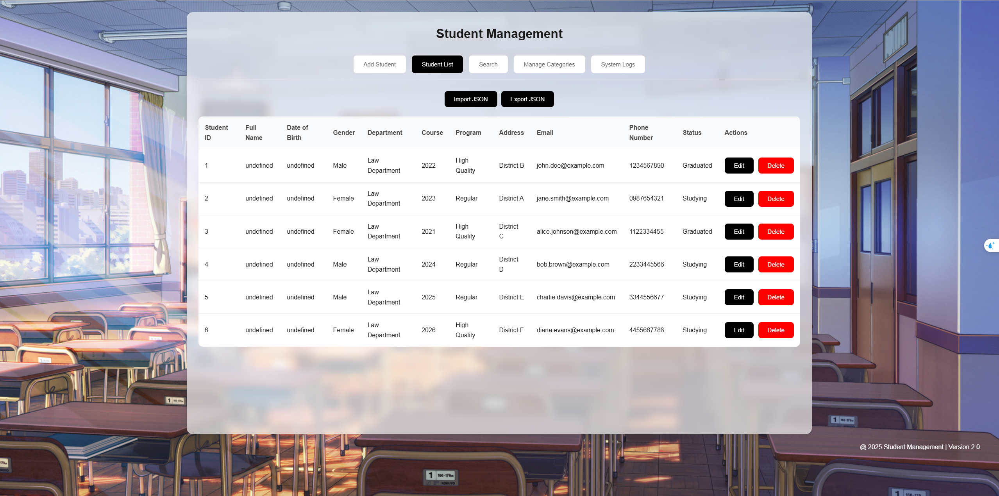

# Student Management System

## Introduction

This is a **Student Management System** implemented in **Go** with an integrated web interface using **HTML, JSX, and JavaScript**. The system allows users to manage a list of students with functionalities such as adding, deleting, updating, and searching students.

In the future, we will integrate a **console-based UI written in Go**, providing users with an alternative way to manage students.

## Features

- **Add Student**: Input student details via the web interface and save them.
- **Delete Student**: Remove a student from the list using their Student ID.
- **Update Student**: Modify a student's details based on their Student ID.
- **Search Student**: Search for students by Full Name or Student ID.
- **Web UI**: A newly added graphical interface for better usability.
- **Future Console UI**: A planned feature to allow text-based interactions.

## Student Information Fields

Each student record contains the following details:

- **Student ID**
- **Full Name**
- **Birth Date** (dd/mm/yyyy)
- **Gender**
- **Faculty** (e.g., Law, Business English, Japanese, French)
- **Course**
- **Program**
- **Address**
- **Email** (validated format)
- **Phone Number** (validated format)
- **Student Status** (e.g., Studying, Graduated, Withdrawn, Suspended)

---

## Folder Structure

```plaintext
student-management/
│
├── models/
│   └── student.go            # Student struct definition
│
├── services/
│   └── student.service.go    # Student service functions (Add, Delete, Update, Search)
│
├── tests/
│   └── student_test.go       # Unit tests for student services
│
├── utils/
│   ├── to_string.go         # Utility functions for string formatting
│   └── validation.go        # Input validation functions (Email, Phone, etc.)
│
├── previews/
│   ├── add-student.png      # Preview of Add Student functionality
│   ├── logging.png          # Preview of system logs
│   ├── manage-categories.png # Preview of category management
│   ├── search.png           # Preview of Search Student functionality
│   ├── student-list.png     # Preview of student list page
│
├── web/
│   ├── index.html           # Main HTML file for the web interface
│   ├── logging.jsx          # JSX component for logging
│   ├── category.jsx         # JSX component for category management
│   ├── manager.jsx          # JSX component for student management
│   ├── student-management-style.css # CSS file for styling
│
├── go.mod                   # Go module dependencies
├── main.go                  # Main program execution
├── Makefile                 # Make commands for build/run/test
├── README.md                # Documentation
└── student-management.exe   # Compiled executable (optional)
```

## Installation

### Prerequisites

Ensure you have **Go installed** on your system:

```sh
# Check if Go is installed
go version
```

If Go is not installed, download and install it from [Go's official website](https://go.dev/dl/).

### Install Dependencies

```sh
go mod tidy
```

---

## Running the System

### Run the Backend (Go)

```sh
go run main.go
```

### Build the Executable

```sh
go build -o student-manage.exe main.go
```

### Run Tests

```sh
go test -v ./tests
```

### Running the Web Interface

### Option 1: Using Live Server in VS Code (Recommended)

1. Open **VS Code** and install the extension **"Live Server"** (if you haven't already).
2. Navigate to the **web/** folder in VS Code.
3. Right-click on `index.html` and select **"Open with Live Server"**.
4. Your default browser will automatically open the web interface.

### Screenshots

Below are some screenshots of the Student Management System:

| Add Student                                 | Logging                             |
| ------------------------------------------- | ----------------------------------- |
|  |  |

| Manage Categories                                       | Search                            |
| ------------------------------------------------------- | --------------------------------- |
|  |  |

| Student List                                  | Import json                        |
| --------------------------------------------- | ---------------------------------- |
|  |  |

---

## Future Plans

- Integrate a Console UI written in Go to provide a command-line interface.
- Enhance the Web UI with more interactive features.
- Improve API functionality for better integration with external systems.
