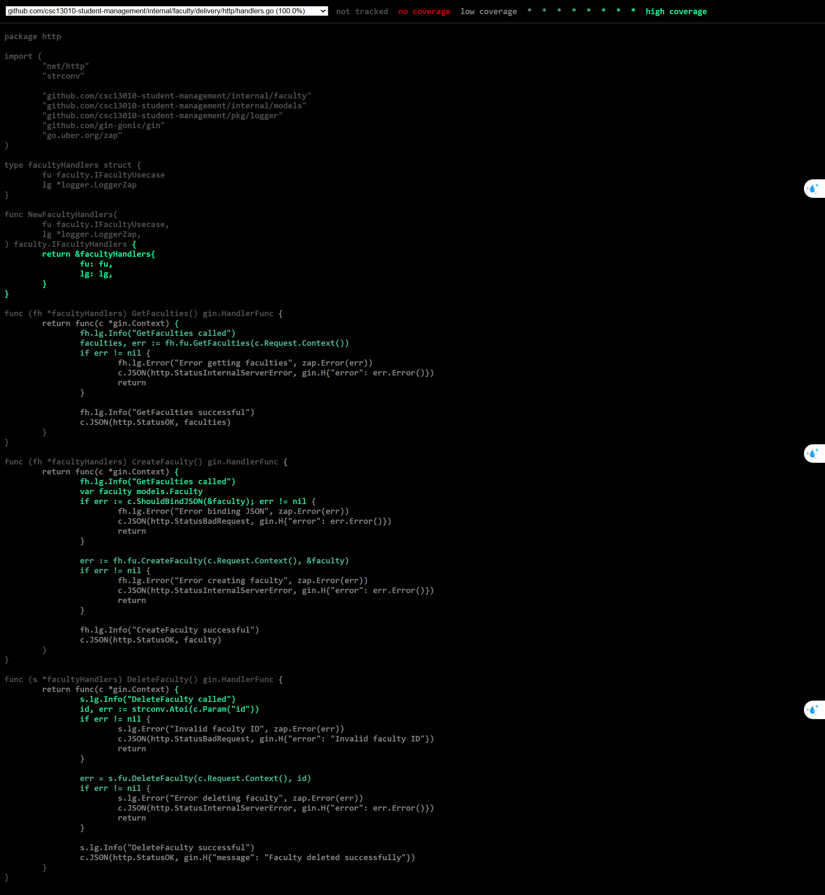
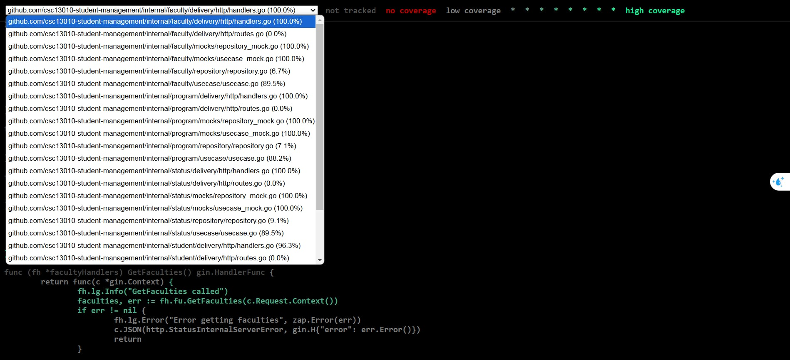

# Student Management System

## Introduction

This is a **Student Management System** implemented in **Go** for the backend and **Next.js with Shadcn UI and Redux** for the frontend. The system allows users to manage a list of students with functionalities such as adding, deleting, updating, and searching students.

## Technologies Used


## Features

### Version 1.0

**Student Management**

- Add New Student – Supports adding **Faculty, Student Status, Training Program**.
- Delete Student – Remove a student by **Student ID (MSSV)**.
- Update Student Information – Modify student details by **Student ID**.
- Search Students – Search by **Full Name, Student ID, Faculty**, or a combination of **Faculty + Student Name**.
- Import/Export Data – Supports at least **two formats**: **CSV, JSON, XML, Excel**.
- Logging Mechanism – Records logs for **troubleshooting & audit purposes**.

#### Student Information Fields

Each student record contains the following details:

- **Student ID**
- **Full Name**
- **Birth Date** (dd/mm/yyyy)
- **Gender**
- **Faculty** (e.g., Law, Business English, Japanese, French)
- **Course**
- **Program**
- **Address**
- **Email** (validated format)
- **Phone Number** (validated format)
- **Student Status** (e.g., Studying, Graduated, Withdrawn, Suspended)

### Version 2.0 Enhancements

- **Data Storage** – Supports **JSON, CSV, Database**.
- **Dynamic Modifications** – Rename/Add **Faculty, Student Status, Program**.
- **Advanced Search** – Search by **Faculty, Faculty + Student Name**.
- **Data Import/Export** – Supports **CSV, JSON**.
- **Enhanced Logging Mechanism** – Logs for troubleshooting & production.
- **Show Application Version & Build Date**

### Version 3.0 Enhancements

#### Business Rule Enhancements

- **Unique Student ID (MSSV)** – Ensure MSSV is unique when adding or updating a student.
- **Configurable Email Domain** – Accept only emails from a specific domain, e.g., `@student.university.edu.vn`.
- **Valid Phone Number Format** – Validate phone numbers according to country-specific formats, e.g., Vietnam (`+84` or `0[3|5|7|8|9]xxxxxxxx`).
- **Student Status Rules** – Enforce rules for changing student status, e.g., `"Studying"` can change to `"On Hold"`, `"Graduated"`, `"Suspended"`, but `"Graduated"` cannot change back to `"Studying"`.

#### Web UI Enhancements

- **Next.js and Shadcn UI** – Implement the web interface using Next.js and Shadcn UI for a responsive and modern user experience.

## Folder Structure

The project follows the principles of Clean Architecture, ensuring separation of concerns and maintainability. Below is an overview of the folder structure:

```plaintext
csc13010-student-management/
│
├── cmd/                                # Application entry point
│
├── config/                             # Application configuration (database, env, etc.)
│
├── initdb/                             # Initial database setup
│
├── internal/                           # Contains main application modules
│   │
│   ├── auditlog/                       # Audit Log Module (System logging)
│   │   ├── delivery/http/              # HTTP communication layer (Controller, Handler)
│   │   │   ├── handlers_test.go        # Unit tests for handlers.go
│   │   │   ├── handlers.go             # Handles client requests
│   │   │   ├── routes.go               # Defines API routes
│   │   ├── mocks/                      # Mock implementations for testing
│   │   │   ├── usecase_mock.go         # Mock implementation for usecase.go
│   │   │   ├── repository_mock.go      # Mock implementation for repository.go
│   │   │
│   │   ├── repository/                 # Database query layer (Repository Pattern)
│   │   │   ├── repository_test.go      # Unit tests for repository.go
│   │   │   ├── repository.go           # Database interaction logic
│   │   │
│   │   ├── usecase/                    # Business logic layer
│   │   │   ├── usecase_test.go         # Unit tests for usecase.go
│   │   │   ├── usecase.go              # Handles business logic related to audit logs
│   │   │
│   │   ├── delivery.go                 # Delivery layer for audit log module (interface)
│   │   ├── handlers.go                 # HTTP handlers for audit log module (interface)
│   │   ├── usecase.go                  # Business logic for audit log module (interface)
│   │
│   ├── faculty/                        # Faculty Management Module
│   ├── fileprocessor/                  # File processing (Import/Export CSV, JSON)
│   ├── initialize/                     # Module initialization (Dependency Injection)
│   ├── migration/                      # Database migration
│   ├── models/                         # Contains application model definitions
│   ├── notification/                   # Notification Module (Email, SMS, Web Push)
│   ├── program/                        # Program Management Module
│   ├── server/                         # Initializes HTTP server with Gin and integrates modules
│   ├── status/                         # Status Management Module
│   ├── student/                        # Student Management Module
│
├── requirements/                       # System requirements (docs, specs, etc.)
├── docker-compose.yml                  # Docker Compose configuration for containerized environment
├── go.mod                              # Module and dependencies declaration
├── main.go                             # Application entry point
├── Makefile                            # Utility commands for build/run/test
├── README.md                           # User guide documentation
```

## Installation

### Prerequisites

Ensure Go is installed on your system:

```sh
# Check if Go is installed
go version
```

If Go is not installed, download and install it from Go's official website.

### Install Dependencies

Navigate to the project directory and run:

```sh
go mod tidy
```

This will download and clean up dependencies.

### Running the System

### Running the System

#### Run Docker Compose

First, start the Docker containers:

```sh
docker compose up -d
```

To stop and remove the containers, run:

```sh
docker compose down -v
```

#### Run the Backend (Go)

```sh
make run
```

#### Build the Executable

```sh
make build
```

### Running the Web Interface

#### Prerequisites

Ensure Node.js is installed on your system:

```sh
# Check if Node.js is installed
node -v
```

If Node.js is not installed, download and install it from Node.js' official website.

#### Start the Web Interface

Navigate to the frontend directory:

```sh
cd web
```

Then install dependencies and start the development server:

```sh
pnpm install
pnpm run dev
```

The web interface should now be accessible at:

```plaintext
http://localhost:3000
```

## Testing

### Run Unit Tests

Run unit tests for the entire project:

```sh
make test
```

Or run tests for a specific package, for example:

```sh
make test-cover-package name=student
```

If not using a Makefile, you can run tests directly:

```sh
go test ./...
```

### Run Test Coverage

Test coverage helps check the extent of unit test coverage on the code.

Run test coverage for the entire project:

```sh
make test-cover
```

This command will generate a `coverage.out` file containing coverage information.

Run test coverage for a specific package:

```sh
make test-cover-package name=student
```

If you want to run directly without using a Makefile:

```sh
go test -coverprofile=coverage.out ./...
```

### View Coverage Report as HTML

After running test coverage, you can view the report as HTML:

```sh
make test-cover-html
```

Then open the `coverage.html` file in a browser to view detailed coverage.

If not using a Makefile, you can run:

```sh
go tool cover -html=coverage.out -o coverage.html
```

Then open the `coverage.html` file in a browser.

### Debugging Unit Tests

If a test fails, you can run with the `-v` option to see detailed logs:

```sh
go test -v ./...
```

To check a specific test case:

```sh
go test -run Test_FunctionName ./internal/student/
```

### Notes

Ensure test files have the `_test.go` suffix so Go can recognize them.

If you encounter dependency-related errors, run `go mod tidy` before testing.

To view the coverage of a specific file, you can use:

```sh
go tool cover -func=coverage.out
```

### Screenshots

## Screenshots

Below are some screenshots of the Student Management System:

| Student List                                       | Edit & Delete Actions                                      |
| -------------------------------------------------- | ---------------------------------------------------------- |
|  |  |

_Student List_: List students using a table.
_Edit & Delete Actions_: The table shows a list of students and their information, with actions for each student to edit or delete.

| Table Columns Selection                                      | Hidden Columns                                                       |
| ------------------------------------------------------------ | -------------------------------------------------------------------- |
|  |  |

_Table Columns Selection_: Show student information by choosing the columns you want.
_Hidden Columns_: Hide some columns.

| Export - Choose Folder                                           | Export Options (CSV/JSON)                                     |
| ---------------------------------------------------------------- | ------------------------------------------------------------- |
|  |  |

_Export - Choose Folder_: Show the screen to choose a folder to download.
_Export Options (CSV/JSON)_: Options to download CSV or JSON.

| Import Students (Drag & Drop)                           | Import CSV Example                                           |
| ------------------------------------------------------- | ------------------------------------------------------------ |
|  |  |

_Import Students (Drag & Drop)_: Import student files supporting CSV or JSON, with drag and drop functionality.
_Import CSV Example_: Demo importing a file `students.csv`, then clicking upload to import.

| Filter Students by Columns                                    | Search Students by Name                        |
| ------------------------------------------------------------- | ---------------------------------------------- |
|  |  |

_Filter Students by Columns_: Filter students by program (choose the select on the header table), supporting filters by gender, faculty, course, program, status.
_Search Students by Name_: Search students by name.

| Manage Faculty, Program, Status                                               | Audit Log for Actions                          |
| ----------------------------------------------------------------------------- | ---------------------------------------------- |
|  |  |

_Manage Faculty, Program, Status_: List options for faculty, program, status. You can add, edit, delete each of these.
_Audit Log for Actions_: Audit log records when creating/updating/deleting, etc.

| Test Coverage - Faculty Handlers                                                | Test Coverage - All Test                                                         |
| ------------------------------------------------------------------------------- | -------------------------------------------------------------------------------- |
|  |  |

_Test Coverage - Faculty Handlers_: Demo test coverage for handlers of faculty.
_Test Coverage - Selection test_: this is all test you can see.

<!-- Below are some screenshots of the Student Management System:

| Add Student                                 | Logging                             |
| ------------------------------------------- | ----------------------------------- |
|  |  |

| Manage Categories                                       | Search                            |
| ------------------------------------------------------- | --------------------------------- |
|  |  |

| Student List                                  | Import json                                 |
| --------------------------------------------- | ------------------------------------------- |
|  |  | -->

---
